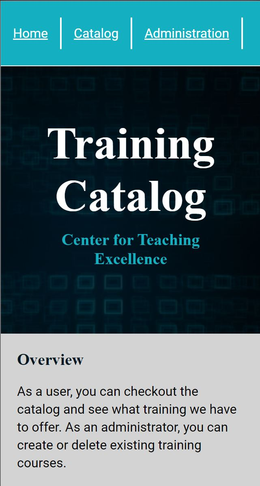
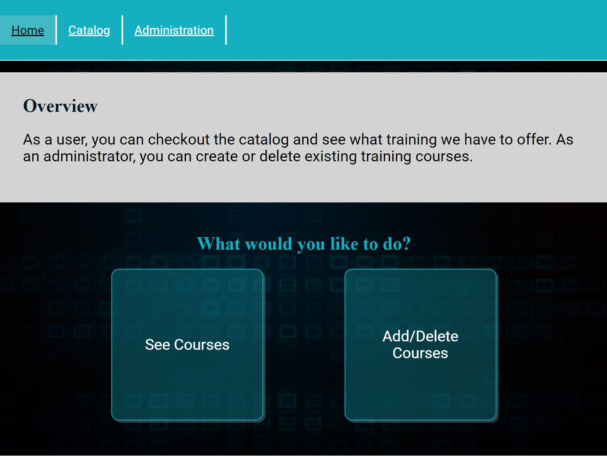
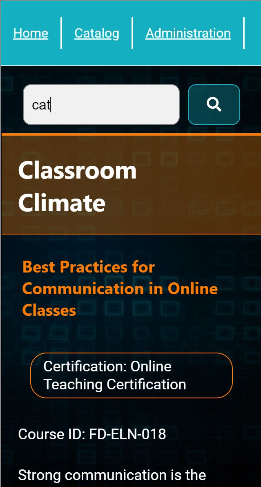
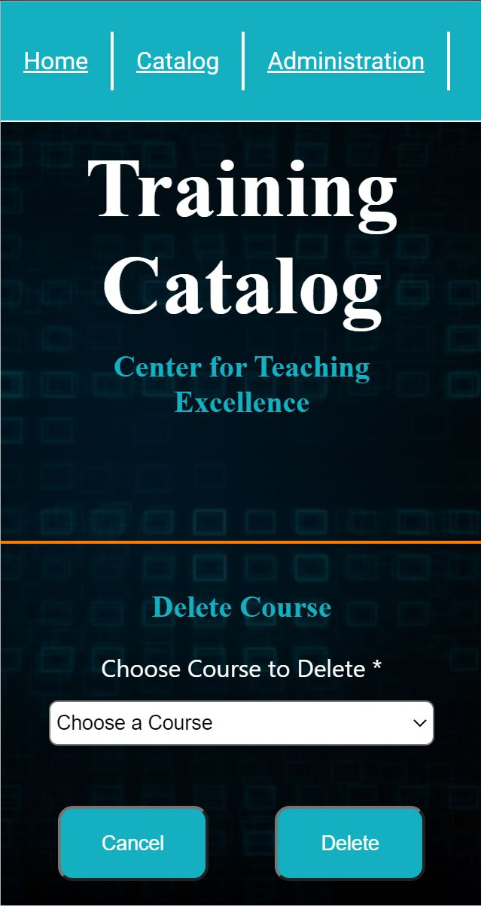
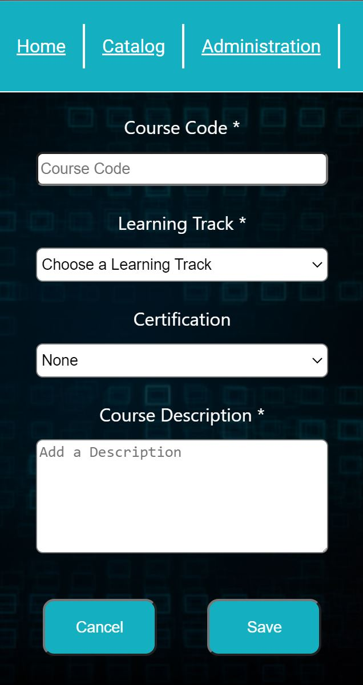
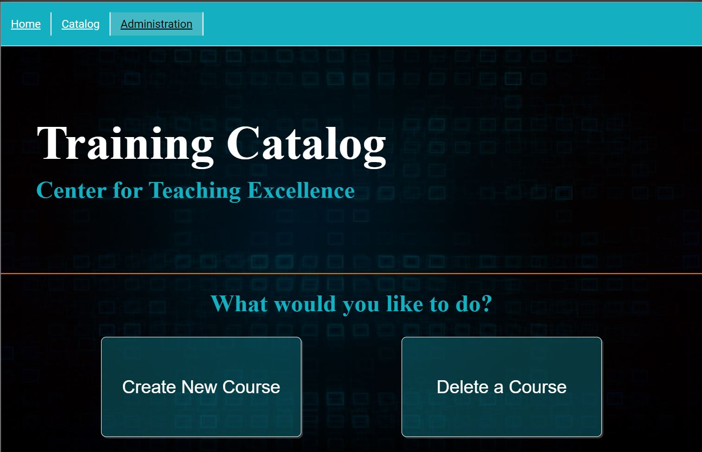

# Center for Teaching Excellence Catalog

> [Catalog App](https://catalog-app.vercel.app/) \| [App GitHub Repo](https://github.com/ikarskarn/catalog-app) \| [Api GitHub Repo](https://github.com/ikarskarn/catalog-api)

The Center for Teaching Excellence Catalog utilizes the custom API created by Marc Tucker. [API DOCUMENTATION HERE](https://github.com/ikarskarn/catalog-api/blob/master/README.md)

## Introduction

As an instructional designer, web developer, and game developer for the Center for Teaching and Learning Excellence, an ever changing course catalog is essential to providing information to faculty and staff about learning and training opportunities.

> This version of the app is intended to demo the app's functionality and provide observers with the opportunity to experience the app from the perspective of both the end user and administrator.

## Tools

The tools used in the creation of this app include:

Front end: **React** \| **CSS** \| **JQuery**
Back end: **Express** \| **Node.js** \| **PostgreSQL**

## Purpose

The purpose of this catalog is to make it as simple as possible for faculty and staff to see the courses and trainings offered by the Center. Another feature of the app is providing a page for other instructional designers and administrators to create new courses and delete courses that are no longer needed.

## Style

Below is a list of the current pages and a brief description of their purpose and intentional design.

## Landing Page

The landing page is to simply provide users, administrators, and observers with a brief description about the app and what steps can be taken next.

 &nbsp; &nbsp; &nbsp; 

## Catalog Page

The Catalog page provides a full list of available courses divided up into categories, a search feature, and also includes connections to Learning Tracks and Certifications where available.

 &nbsp; &nbsp; &nbsp; 

## Administrative Page

The Admin page is for use by Instructional Designers, Administrators, and Observers. The Page includes two forms; _Create New Course_ Form and _Delete Course_ Form.

 &nbsp; &nbsp; &nbsp; 

## API ENDPOINTS

Below are the list of endpoints available for the API

### CATEGORIES

/api/categories

-   **GET**: get all categories

### LEARNING TRACKS

/api/learning-tracks

-   **GET**: get all learning tracks

### COURSES

/api/courses

-   **GET**: get all courses
-   **POST**: post new course

/api/courses/:course_id

-   **DELETE**: delete course by id
